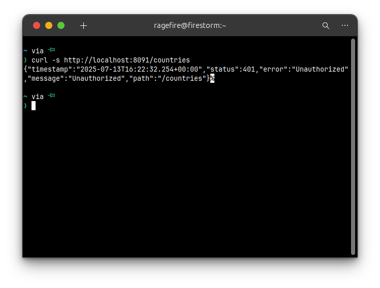
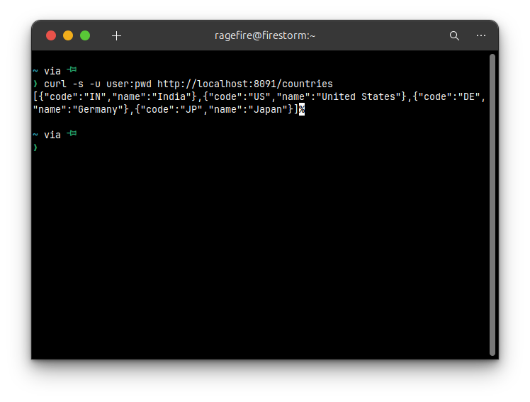
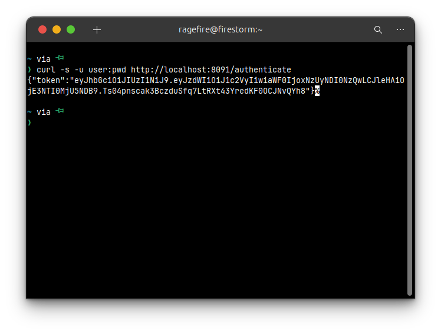
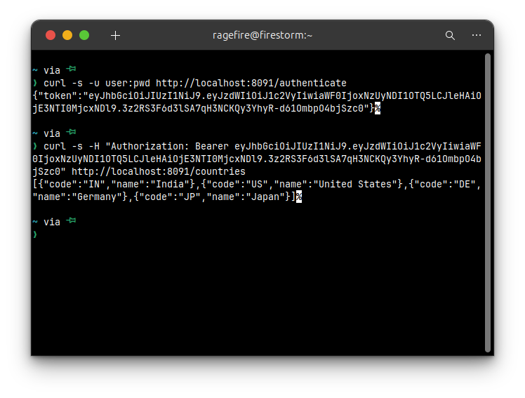
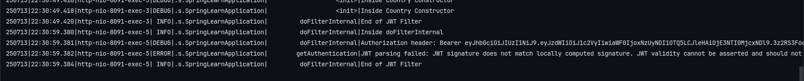

# JWT Authentication with Spring Security - Hands-on Project

This project demonstrates how to secure RESTful web services using **Spring Security** with **JWT (JSON Web Tokens)**. It evolves from basic HTTP authentication to fully token-based stateless authentication.

---

## 🔧 Objectives

- Secure REST APIs with Spring Security
- Implement HTTP Basic Authentication
- Create and validate JWT tokens
- Use Spring Filters to authorize JWT-based requests

---

## ⚠️ Note on Port Configuration

> **Important:** The default port `8090` was already in use on the system, so the server was configured to run on a different port.  
> Please ensure you're using the correct port (e.g., `8091`, `9090`, etc.) in all curl commands and browser tests.

You can change the port in `application.properties` like this:
```properties
server.port=8091
````

---

## 📁 Project Structure

* `SecurityConfig.java`: Configuration for HTTP Basic and JWT authentication.
* `AuthenticationController.java`: Provides `/authenticate` endpoint for token generation.
* `JwtAuthorizationFilter.java`: Validates JWT on incoming requests.

---

## 🧪 Testing Basic Authentication

### 🔐 Unauthorized Access

Use the following curl command to test unauthorized access:

```bash
curl -s http://localhost:8091/countries
```

Expected response:

```json
{"status":401,"error":"Unauthorized"}
```



### ✅ Authorized Access

```bash
curl -s -u user:pwd http://localhost:8091/countries
```

Expected response:

```json
[{"code":"US","name":"United States"}, ...]
```



---

## 👥 Role-Based Access

In-memory users:

* `user / pwd` → Role: USER
* `admin / pwd` → Role: ADMIN

`/countries` endpoint is restricted to the `USER` role.

---

## 🔄 JWT Authentication Flow

1. Client sends credentials
2. Server validates and returns a JWT
3. Client uses JWT in Authorization header for subsequent requests
4. Server validates token via a custom filter

---

## 🔑 Get JWT Token

Use the `/authenticate` endpoint to get a JWT:

```bash
curl -s -u user:pwd http://localhost:8091/authenticate
```

Sample response:

```json
{"token":"<JWT_TOKEN_HERE>"}
```




---

## 📥 Using JWT to Access Secured Endpoint

Replace `<JWT_TOKEN_HERE>` with actual token:

```bash
curl -s -H "Authorization: Bearer <JWT_TOKEN_HERE>" http://localhost:8091/countries
```

Expected result:

```json
[{"code":"US","name":"United States"}, ...]
```



---

## 🛑 Invalid Token Check

Test with modified/expired token:

```bash
curl -s -H "Authorization: Bearer <INVALID_TOKEN>" http://localhost:8091/countries
```

Expected response:

```json
{"status":403,"error":"Forbidden"}
```


---

## ⚙️ Libraries Used

* `spring-boot-starter-security`
* `jjwt` (Java JWT: `io.jsonwebtoken:jjwt:0.9.0`)

---

## 🔒 Why JWT?

JWT solves the limitation of sending username/password with each request. Tokens are:

* Self-contained
* Tamper-resistant
* Stateless and efficient

---

## 📚 References

* [Spring Security Guide](https://www.mkyong.com/spring-boot/spring-rest-spring-security-example/)
* [JWT Java](https://github.com/jwtk/jjwt)
* [Auth0 Blog on Spring JWT](https://auth0.com/blog/implementing-jwt-authentication-on-spring-boot/)

