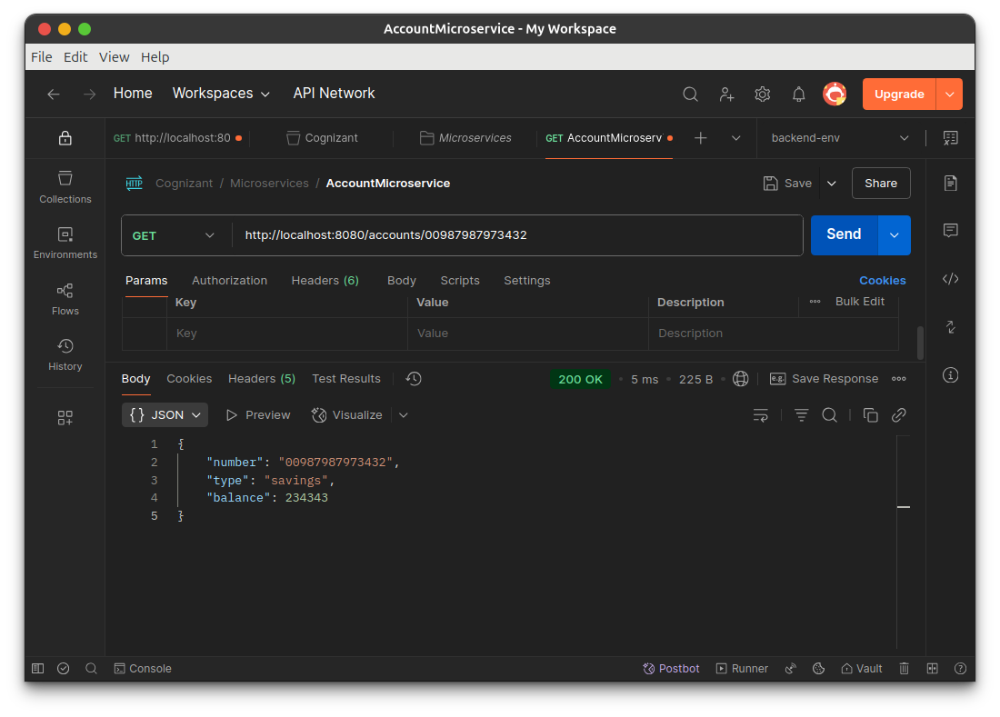

# Microservices System (Without Eureka)  

This document details my implementation of a simple Java microservices system **without service discovery** (Eureka) as part of Cognizant DN 4.0 Week 5. This setup demonstrates fundamentals of microservices—independent modules communicating via REST, each deployed and maintained separately.

---

## Overview

In this hands-on, I have developed two standalone Spring Boot microservices:

- **Account Microservice** – Manages and serves account details.
- **Loan Microservice** – Manages and serves loan details.

Each microservice runs on its own port. There is *no discovery server or gateway*: clients access endpoints directly using explicit URLs.

---

## Project Structure

```
/WithoutEurekaServer
├── account        # Account microservice (Spring Boot)
├── loan           # Loan microservice (Spring Boot)
├── screenshots    # API responses and UI screenshots
└── README.md
```

---

## Features

- **Completely Independent Services:** Each is a full Spring Boot application.
- **Manual Port Assignment:** No ports conflict. Each service is set to a different port in its config.
- **No Central Service Registry or Gateway.**
- **Stateless Demo API:** No backend database—responses are generated in-memory for demonstration purposes.
- **Simple REST Endpoints:** See API details below.

---

## Prerequisites

- Java 17 or higher
- Maven 3.6+
- (Optional) IDE: Eclipse, IntelliJ, or VS Code

---

## Getting Started

### 1. Build Microservices

Open two terminal windows:

```
cd account
mvn clean package

cd ../loan
mvn clean package
```

### 2. Configure Application Ports

Assign unique ports to each service.  
Edit the following files as shown:

- `account/src/main/resources/application.properties`:
  ```
  server.port=8080
  ```
- `loan/src/main/resources/application.properties`:
  ```
  server.port=8081
  ```

### 3. Run Each Service

In separate terminal windows, start each microservice:

```
cd account
mvn spring-boot:run
```

```
cd loan
mvn spring-boot:run
```

---

## API Endpoints & Testing

You can use your browser or tools like Postman/cURL to access:

| Service           | Endpoint                         | Example URL & Result                           |
|-------------------|----------------------------------|------------------------------------------------|
| Account           | `GET /accounts/{number}`         | `http://localhost:8080/accounts/00987987973432``{ "number": "00987987973432", "type": "savings", "balance": 234343 }` |
| Loan              | `GET /loans/{number}`            | `http://localhost:8081/loans/H00987987972342``{ "number": "H00987987972342", "type": "car", "loan": 400000, "emi": 3258, "tenure": 18 }` |

---

## Screenshots

Below are screenshots of successful API responses:

### 1. Account Microservice Result


### 2. Loan Microservice Result


---

## Notes & Best Practices

- **Direct Access**: All services are accessed directly via their IP/port (no gateway; no discovery).
- **Stateless**: No connected database.
- **Independent Lifecycle**: Each microservice can be updated, rebuilt, or deployed independently.
- **Simple Scaling**: To scale, run more service instances on different ports.

---

## Troubleshooting

- **Port in Use**: If a service fails to start, ensure the assigned port isn't already in use.
- **Port Assignment**: If you add new services or want to run multiple instances, use a unique `server.port` per instance.
- **Building Issues**: Always run `mvn clean package` before starting the services if you made code changes.

---

Thank you for checking out my Week 5 Cognizant DN 4.0 microservices hands-on.  
For any questions or suggestions, feel free to reach out!
