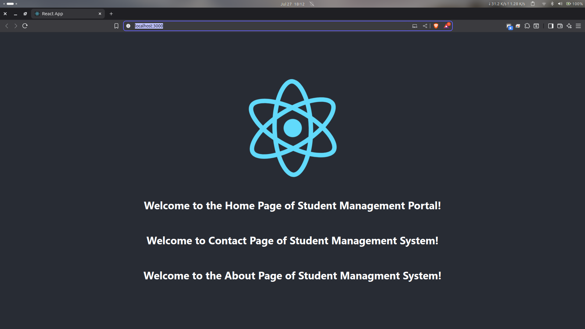
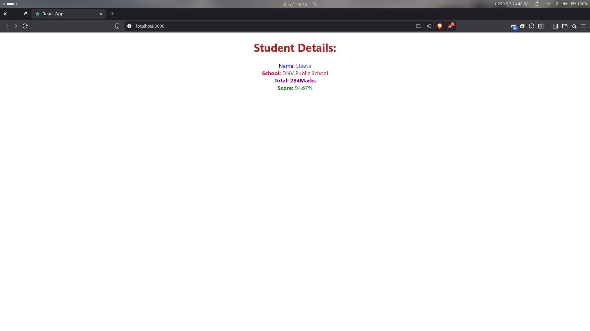
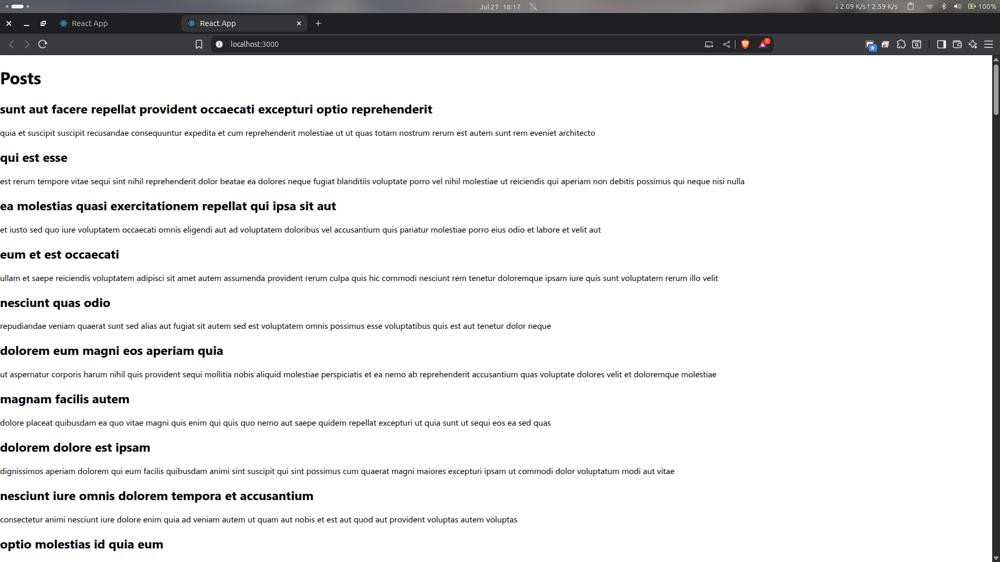
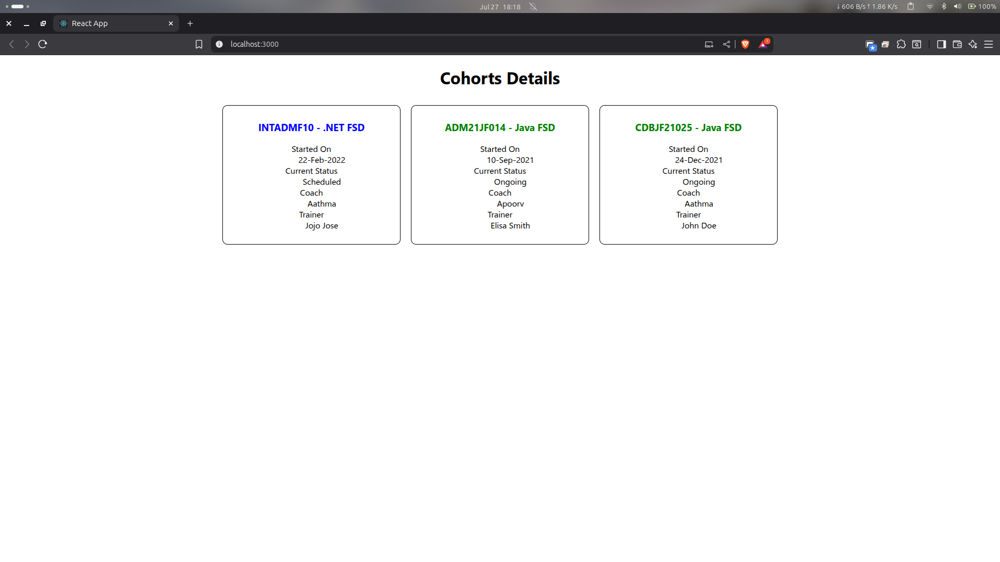

# ReactJS Hands-On Labs Collection

This repository contains a collection of five individual React projects, each developed as part of a hands-on lab exercise. The projects are designed to provide a practical understanding of core React concepts, progressing from the fundamentals of setting up an application to more advanced topics like component lifecycle and styling strategies.

Each project is self-contained in its own directory and represents a specific learning module.
Prerequisites

Before you begin, ensure you have the following installed on your local machine:

    Node.js (which includes npm)

    A code editor of your choice, such as Visual Studio Code

## 1. Lab 1: My First React App (myfirstreact)

Objective: To understand the basic setup of a React development environment and create a simple "Hello World" style application. This lab serves as the entry point to the React ecosystem.

Key Concepts Covered:

    Environment Setup: Using create-react-app to bootstrap a new React project without manual configuration.

    Project Structure: Familiarizing with the default folder and file structure (`public`, `src`, `package.json`).

    Core Component: Editing the main `App.js` component, which is the root of the React application.

    JSX: Writing basic JSX syntax to render HTML-like elements in JavaScript.

Files Created/Modified:

    `src/App.js`: Modified to display the custom welcome message.

Setup and Running:

    Navigate to the project directory: `cd myfirstreact`

    Install the necessary dependencies: `npm install`

    Start the development server: `npm start`

    Open your browser and visit `http://localhost:3000`.

### Expected Output:
The browser will display a simple page with a single heading that reads: "welcome to the first session of React".

---

## 2. Lab 2: Class Components (StudentApp)

Objective: To learn how to create and render multiple class-based components within a single React application, establishing a foundation for building more complex UIs.

Key Concepts Covered:

    Class Components: Defining components as ES6 classes that extend `React.Component`.

    `render()` Method: Understanding that the render() method is required and is where the component's UI is defined.

    Component Organization: Structuring the application by creating separate files for each component (`Home.js`, `About.js`, `Contact.js`).

    Component Composition: Assembling a UI by rendering multiple child components within a single parent component (App.js).

Files Created/Modified:

    `src/components/Home.js` (New)

    `src/components/About.js` (New)

    `src/components/Contact.js` (New)

    `src/App.js`: Modified to import and render the new components.

Setup and Running:

    Navigate to the project directory: `cd StudentApp`

    Install the necessary dependencies: `npm install`

    Start the development server: `npm start`

    Open your browser and visit `http://localhost:3000`.

### Expected Output:
The page will display three lines of text, each from a different component:

    "Welcome to the Home page of Student Management Portal"

    "Welcome to the About page of the Student Management Portal"

    "Welcome to the Contact page of the Student Management Portal"

    
---

## 3. Lab 3: Functional Components & Props (scorecalculatorapp)

Objective: To build a reusable functional component that accepts data via props and to apply basic styling using an external CSS file.

Key Concepts Covered:

    Functional Components: Creating lightweight components using simple JavaScript functions.

    Props: Passing data from a parent component down to a child component via attributes.

    Destructuring Props: Accessing prop values in a cleaner, more concise way.

    External CSS: Linking a .css stylesheet to a component to apply styles.

Files Created/Modified:

    `src/components/CalculateScore.js` (New)

    `src/stylesheets/mystyle.css` (New)

    `src/App.js`: Modified to import and render the CalculateScore component, passing it data via props.

Setup and Running:

    Navigate to the project directory: `cd scorecalculatorapp`

    Install the necessary dependencies: `npm install`

    Start the development server: `npm start`

    Open your browser and visit `http://localhost:3000`.

### Expected Output:
The application will display a styled box containing student information and a calculated score percentage, based on the props passed to the CalculateScore component.

---

## 4. Lab 4: Component Lifecycle & Data Fetching (blogapp)

Objective: To understand the component lifecycle in class components and to fetch data from an external API when the component mounts.

Key Concepts Covered:

    Component State: Using the constructor to initialize the component's internal state.

    `componentDidMount()`: Utilizing this lifecycle method to perform side effects, like API calls, after the component is added to the DOM.

    Fetch API: Making asynchronous network requests to a REST API to get data.

    State Updates: Using `this.setState()` to update the component's state and trigger a re-render.

    Rendering Lists: Dynamically rendering a list of elements from an array in the state using the `.map()` method.

    Error Handling: Implementing `componentDidCatch()` as a basic mechanism for catching and handling errors in the component tree.

Files Created/Modified:

    `src/Post.js` (New)

    `src/Posts.js` (New)

    `src/App.js`: Modified to render the Posts component.

Setup and Running:

    Navigate to the project directory: `cd blogapp`

    Install the necessary dependencies: `npm install`

    Start the development server: `npm start`

    Open your browser and visit `http://localhost:3000`.

### Expected Output:
The page will initially be empty, and then it will populate with a list of blog posts fetched from the JSONPlaceholder API. Each post will display its title as a heading and its body as a paragraph.

---

## 5. Lab 5: Advanced Styling (cohortstracker)

Objective: To apply modern styling techniques to a React application, including CSS Modules for scoped styling and conditional inline styles for dynamic UIs.

Key Concepts Covered:

    CSS Modules: Creating .module.css files to scope CSS class names locally to a component, which prevents global style conflicts.

    Inline Styling: Applying styles directly to an element using the style attribute and a JavaScript object.

    Conditional Styling: Dynamically changing styles based on the component's props or state, allowing the UI to react to data.

Files Created/Modified:

    `src/CohortDetails.module.css` (New)

    `src/CohortDetails.js`: Modified to import and use the CSS module and apply conditional inline styles.

    `src/App.js`: Modified to render multiple CohortDetails components with different data.

Setup and Running:

    Navigate to the project directory: `cd cohortstracker`

    Install the necessary dependencies: `npm install`

    Start the development server: `npm start`

    Open your browser and visit `http://localhost:3000`.

### Expected Output:
The page will display a "Cohorts Details" heading followed by three styled cards, arranged side-by-side. Each card will show cohort information. The cohort name will be colored green for "Ongoing" status and blue for any other status.

