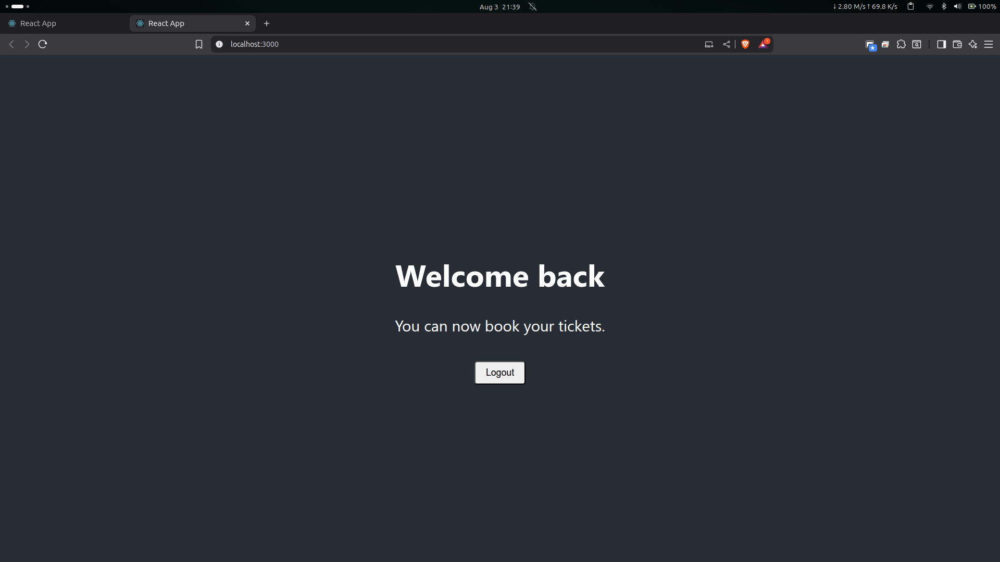

# **Cognizant Digital Nurture 4.0 \- ReactJS Hands-on-Labs**

This repository contains the completed projects for the ReactJS module of the Cognizant Digital Nurture 4.0 program. Each project corresponds to a specific Hands-on-Lab (HOL) designed to build proficiency in core React and modern JavaScript concepts.

## **1\. Project: cricketapp (ES6 Features)**

*(HOL Document: 9\. ReactJS-HOL.docx)*

### **Objective**

This project demonstrates the fundamental features of ES6 within a React application. It involves creating components to display and manipulate a list of cricket players and their scores.

### **Key Concepts Implemented:**

* **map() method:** Used to iterate over an array of player objects and render them as a list.  
* **Arrow Functions:** Implemented to filter players based on a condition (scores less than 70).  
* **Array Destructuring:** Utilized to extract and display specific players from an array (e.g., odd and even team players).  
* **Spread Operator (...):** Employed to merge two separate arrays of players (T20Players and RanjiTrophyPlayers) into a single array.  
* **Conditional Rendering:** A simple if/else flag was used to toggle between displaying different component views on the home page.

### Output:

## **2\. Project: officespacerentalapp (JSX and Styling)**

*(HOL Document: 10\. ReactJS-HOL.docx)*

### **Objective**

This project focuses on using JSX (JavaScript XML) to create and render elements in React. The application displays details for an office space available for rent and applies conditional styling.

### **Key Concepts Implemented:**

* **JSX for Element Creation:** Created React elements and attributes using JSX syntax instead of React.createElement().  
* **JavaScript Expressions in JSX:** Embedded JavaScript variables and object properties directly within the JSX to display dynamic data (e.g., office name, rent, address).  
* **Rendering to the DOM:** Used JSX to define the UI structure that gets rendered to the web page.  
* **Inline CSS Styling:** Applied dynamic inline styles to an element. Specifically, the color of the rent text changes based on its value (red for rent \<= 60000, green otherwise).

### Output:

## **3\. Project: eventexamplesapp (Event Handling)**

*(HOL Document: 11\. ReactJS-HOL.docx)*

### **Objective**

This application was built to explore and demonstrate various event handling mechanisms in React. It includes functionalities like a counter, message displays, and a currency converter, all triggered by user interactions.

### **Key Concepts Implemented:**

* **Event Handlers:** Created functions to respond to user events like button clicks.  
* **State Management (this.setState):** Used to manage the counter's value, incrementing and decrementing it based on button clicks.  
* **Binding this:** Ensured the correct context of this within event handler functions.  
* **Passing Arguments to Event Handlers:** Created a button that invokes a function and passes an argument to it upon clicking.  
* **SyntheticEvent:** Utilized React's cross-browser wrapper for native events to handle a click event.  
* **Form Event Handling:** Implemented a handleSubmit function for the currency converter to process the conversion logic when a button is clicked.

### Output:

## **4\. Project: ticketbookingapp (Conditional Rendering)**

*(HOL Document: 12\. ReactJS-HOL.docx)*

### **Objective**

This project demonstrates conditional rendering by creating a simple ticket booking application interface that displays different content based on the user's authentication status (logged in or logged out).

### **Key Concepts Implemented:**

* **Conditional Rendering:** The core concept of the lab. Used if statements and element variables to render different components (UserGreeting or GuestGreeting) based on the isLoggedIn state.  
* **Stateful Components:** A parent component holds the isLoggedIn state.  
* **Element Variables:** A variable was used to store the component to be rendered, which was then included in the final JSX.  
* **Component-Based Logic:** Created separate components for the LoginButton and LogoutButton, which trigger state changes in the parent component.  
* **Props:** Passed down event handler functions (like onClick) from the parent component to the button components as props.

### Output:

## **5\. Project: bloggerapp (Lists, Keys, and Advanced Conditional Rendering)**

*(HOL Document: 13\. ReactJS-HOL.docx)*

### **Objective**

This application showcases how to render lists of data and display multiple components using various conditional rendering techniques. The app displays details about courses, books, and blogs.

### **Key Concepts Implemented:**

* **Rendering Multiple Components:** Displayed three distinct components (CourseDetails, BookDetails, BlogDetails) within a single parent component.  
* **Lists and Keys:** Used the map() function to iterate over arrays of data (books, courses, etc.) and render a list of elements. The key attribute was assigned a unique identifier for each list item to help React efficiently update the UI.  
* **Component Extraction:** The logic for rendering each list was encapsulated within its own component.  
* **Conditional Rendering Techniques:** This project was an opportunity to implement various methods of conditional rendering, solidifying the concepts from the previous labs.  
* **Styling and Layout:** Used CSS classes to create a multi-column layout to display the different sections of content side-by-side.

### Output:
