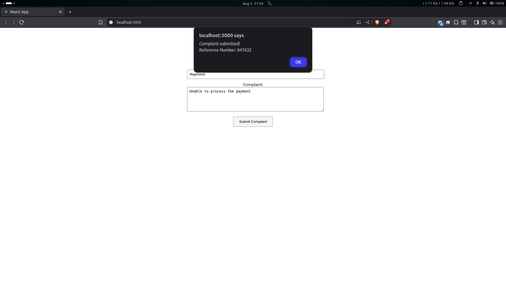
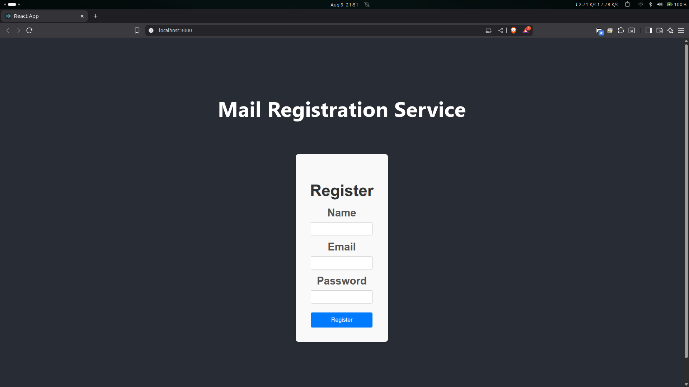
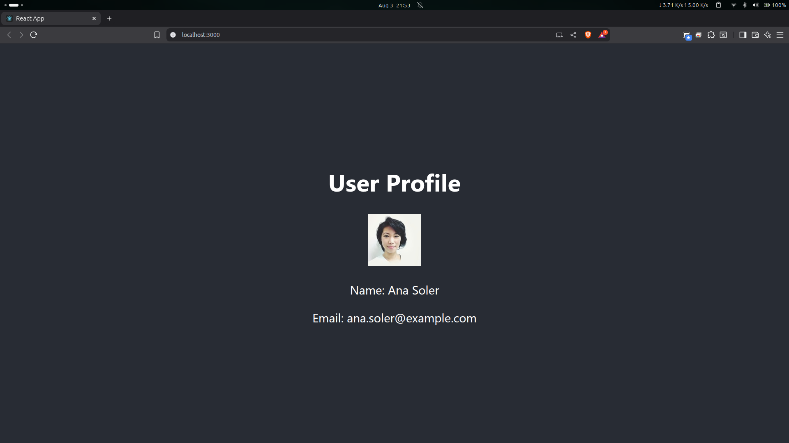

# **Cognizant Digital Nurture 4.0 \- ReactJS Optional Hands-on-Labs**

**Created by: Rohit Tudu** **Superset ID: 6393839**  
This document covers the completed projects for the optional (advanced) ReactJS Hands-on-Labs, focusing on forms, validation, and consuming REST APIs.

## **1\. Project: ticketraisingapp (React Forms)**

*(HOL Document: 15\. ReactJS-HOL.docx)*

### **Objective**

This project focuses on the implementation of forms in React. The application provides a simple interface for a user to register a complaint, demonstrating how to handle form inputs and submission.

### **Key Concepts Implemented:**

* **Controlled Components:** Used component state to manage the values of the form inputs (employee name and complaint text).  
* **Form Input Elements:** Implemented standard HTML form elements like \<input type="text"\> and \<textarea\> within a React component.  
* **Handling Form Submission:** Created a handleSubmit event handler that is triggered when the form's submit button is clicked.  
* **Event Handling (onChange):** An onChange handler was used to update the component's state in real-time as the user types into the input fields.  
* **Preventing Default Behavior:** Used event.preventDefault() within the handleSubmit function to stop the browser's default form submission behavior.

### Output:

## **2\. Project: mailregisterapp (Form Validation)**

*(HOL Document: 16\. ReactJS-HOL.docx)*

### **Objective**

This application builds upon the concepts of React forms by adding client-side validation. It features a registration form that validates user input for name, email, and password fields before submission.

### **Key Concepts Implemented:**

* **Client-Side Validation Logic:** Implemented validation rules directly within the component's event handlers.  
* **State for Error Handling:** Maintained an errors object in the component's state to track and display validation messages for each form field.  
* **Validation on Change and Submit:** Validations were triggered both as the user typed (onChange) and when they attempted to submit the form (onSubmit).  
* **Conditional Logic:** Used conditional checks (e.g., string length, regex for email) to determine if the input data was valid.  
* **User Feedback:** Provided clear feedback to the user by displaying specific error messages when validation rules were not met.

### Output:

## **3\. Project: fetchuserapp (Consuming REST APIs)**

*(HOL Document: 17\. ReactJS-HOL.docx)*

### **Objective**

This project demonstrates how to fetch data from an external REST API and display it within a React application. The app calls a public API to get random user data and renders the user's name and image.

### **Key Concepts Implemented:**

* **fetch() API:** Used the browser's built-in fetch method to make an asynchronous GET request to an external API endpoint (https://api.randomuser.me/).  
* **Lifecycle Methods (componentDidMount):** The API call was initiated within the componentDidMount lifecycle method to ensure the data is fetched after the component has been mounted to the DOM.  
* **Asynchronous JavaScript (async/await):** Used async/await syntax to handle the asynchronous nature of the API call gracefully, making the code more readable.  
* **State for API Data:** Stored the data retrieved from the API in the component's state.  
* **Conditional Rendering for Loading State:** Implemented a loading flag in the state to conditionally render a "loading..." message or the user data, preventing errors while the data is being fetched.  
* **Rendering API Data:** Once the data was fetched and stored in the state, it was rendered in the JSX to display the user's information.

### Output:
